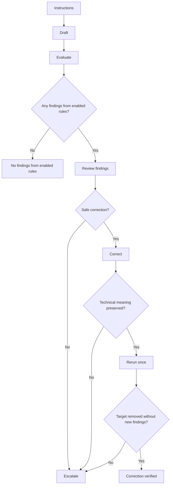

# Beyond Agent Instructions: Context Engineering With Vale

**Table of Contents:**
- [Instructions Alone Provide No Evidence of Compliance](#Instructions-Alone-Provide-No-Evidence-of-Compliance)
- [A Common Evaluator Provides Consistent Evidence](#A-Common-Evaluator-Provides-Consistent-Evidence)
- [Deterministic Feedback Still Requires Validation](#Deterministic-Feedback-Still-Requires-Validation)
- [Corrections Need Verification](#Corrections-Need-Verification)
- [Validate Before Enforcing](#Validate-Before-Enforcing)

## Instructions Alone Provide No Evidence of Compliance

A docs repo I was working in already had a style guide and instructions for coding agents.
Those files described what good docs should look like, but no deterministic check reported whether a draft violated any of their observable prose rules.

Reliable agent workflows need executable evaluation, not just instructions.
For this project, I used [Vale](https://docs.vale.sh/), which is an evaluator that both agents and humans can run.

## A Common Evaluator Provides Consistent Evidence

Vale is a configurable prose linter.
It fit this project because it ran from the repository, reported each finding by file, location, and rule, and let me select rules and severity.

The project produced a bounded protocol for deciding when the agent could correct and verify a finding and when it should escalate for human judgment:



The protocol depended on actionable findings.
Vale reported each finding with a file, location, rule, and message.
That gave the agent enough context to inspect the relevant passage and decide whether to correct or escalate.
A generic quality score alone would not identify what to inspect or change.

The configuration enabled only selected rules at suggestion severity:

```ini
[*.{md,mdx}]
Microsoft.Contractions = suggestion
Microsoft.We = suggestion
Microsoft.Passive = suggestion
Microsoft.Wordiness = suggestion
```

`Vale = NO` disabled Vale's built-in rules. The four named Microsoft rules remained enabled at suggestion severity.
The repository command reported findings without failing the run, which let me measure signal and false positives before allowing the evaluator to block work or drive automatic corrections.

I framed the problem, set acceptance gates, evaluated the evidence, and made the final decisions.
A coding agent implemented the bounded change, gathered findings, ran checks, and corrected defects.

Running the same repository-local configuration produced consistent findings, but consistency alone did not make them useful.
I still needed to test the configuration and the findings.

## Deterministic Feedback Still Requires Validation

The evaluation surfaced one rule that worked as designed but did not fit the content.

I reviewed a bounded sample of findings from authored content and asked whether each proposed change would improve the prose without weakening precision, changing meaning, or fighting an intentional pattern.

The coding agent surfaced findings from a candidate rule that flagged first-person pronouns.
Every sampled finding appeared in intentional reader-voice content, such as scenario labels or example questions.
Applying the rule would have removed that intentional voice, so I rejected it.

That didn't show that the rule was generally bad.
The issue was that the rule encoded a preference that didn't fit this content.
Once a workflow uses deterministic findings to guide an agent's next action, those findings become part of the agent's context.
Imported rules therefore need the same scrutiny as imported instructions.

Testing caught two silent configuration failures: the configuration excluded authored content and enabled an unselected rule.
One hid findings. The other introduced policy I had not chosen.

The corrected implementation passed four bounded validation gates:

- Selected MDX samples produced prose findings without false positives from MDX syntax.
- A sentence designed to trigger an enabled rule produced no findings when placed in an excluded path.
- Canonically sorted finding sets matched across two unchanged runs.
- The existing repository checks and build passed.

Validate an evaluator's mechanics separately from its fit with local policy.
A rule can behave as specified yet encode a preference that doesn't fit the repository.
Repeatability establishes consistency, not usefulness.

Once the retained rules passed those bounded checks, one question remained: Could an agent act on a finding without weakening meaning?

## Corrections Need Verification

One passive-voice finding provided a small but complete test of the loop.

Here is a generalized example:

Before:

> Generated reference content is excluded from prose checks.

After:

> Vale excludes generated reference content from prose checks.

The agent named the actor, preserved the scope of the statement, and reran Vale.
The target finding disappeared without changing the sentence's meaning or introducing another finding in the passage.

The operating boundary allowed a fix only when the change preserved technical meaning.
The agent then reran the focused check.
Escalate ambiguous, persistent, or meaning-sensitive findings rather than forcing a rewrite.

Vale can detect configured prose patterns, but it can't determine whether documentation is technically accurate, complete, useful, or appropriate for its context.
Human judgment remains responsible for those questions.

Escalation gives an agent a third option besides ignoring the evaluator or satisfying it at any cost.
The agent can preserve the content, surface the conflict, and ask for a decision.
Likewise, an edit is only an attempted correction.
The rerun supplies evidence that it worked.

This was the reliability model I wanted: a workflow that made bounded problems visible, supported safe correction, and verified the result instead of assuming first-pass correctness.

## Validate Before Enforcing

This approach isn't specific to Vale.
You can use it when an instruction describes behavior narrow enough to observe and evaluate:

1. Identify one observable requirement from an instruction.
2. Define evidence that would indicate compliance with that requirement.
3. Choose a deterministic evaluator that the workflow can run.
4. Test the evaluator on representative repository cases.
5. Evaluate usefulness, false positives, scope, and repeatability.
6. Define when the agent corrects, reruns, or escalates.
7. Enforce only after representative tests establish useful, repeatable signal.

The same method applies to test suites, type checkers, schema validators, and policy engines.

Find one instruction your agents receive, identify an observable requirement, and ask what evidence would indicate compliance.
